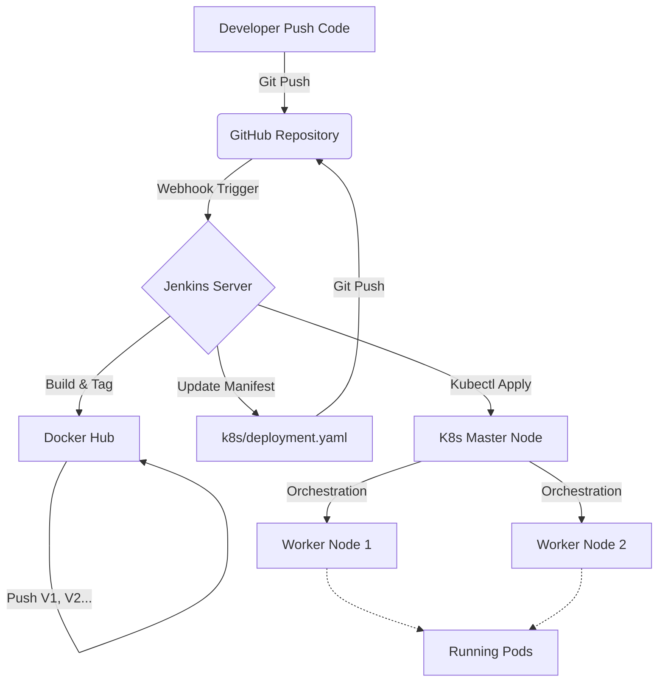

### 🏗️ Project Architecture

```mermaid
graph TD
    A[Developer Push Code] -->|Git Push| B(GitHub Repository)
    B -->|Webhook Trigger| C{Jenkins Server}
    C -->|Build & Tag| D[Docker Hub]
    D -->|Push V1, V2...| D
    C -->|Update Manifest| E[k8s/deployment.yaml]
    E -->|Git Push| B
    C -->|Kubectl Apply| F[K8s Master Node]
    F -->|Orchestration| G[Worker Node 1]
    F -->|Orchestration| H[Worker Node 2]
    G -.-> I[Running Pods]
    H -.-> I
```
